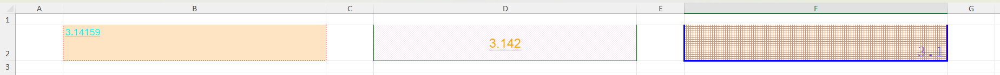
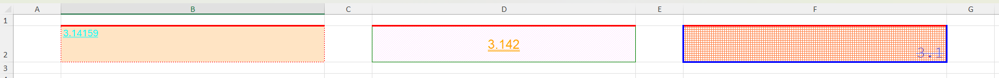
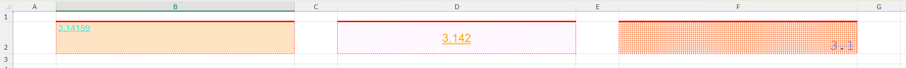
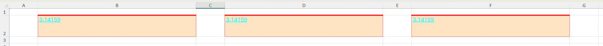

# Cell formats

## Excel formatting

Each cell in an Excel spreadsheet may refer to an Excel `style`. Multiple cells can 
refer to the same `style` and therefore have a uniform appearance. A `style` defines
the cell's `alignment` directly (as part of the `style` definition), but it may also 
refer to further formatting definitions for `font`, `fill`, `border`, `format`. 
Multiple `style`s may each refer to the same `fill` definition or the same `font` 
definition, etc, and therefore share these formatting characteristics.
This hierarchy can be shown like this:
```
                `Cell`
                  │
               `Style` => `Alignment`
                  │
  ┌──────────┬────┴─────┬─────────┐
  │          │          │         │
`font`     `fill`    `border`  `format`
```
A family of setter functions is provided to set each of the formatting characteristics 
Excel uses. These are applied to cells, and the functions deal with the relationships 
between the individual characteristics, the overarching `style` and the cell(s) themselves.

## Setting format attributes of a cell

Set the font attributes of a cell using [`XLSX.setFont`](@ref). For example, to set cells `A1` and 
`A5` in the `general` sheet of a workbook to specific `font` values, use:

```julia

julia> using XLSX

julia> f=XLSX.opentemplate("general.xlsx")
XLSXFile("general.xlsx") containing 13 Worksheets
            sheetname size          range        
-------------------------------------------------
              general 10x6          A1:F10       
               table3 5x6           A2:F6        
               table4 4x3           E12:G15
                table 12x8          A2:H13
               table2 5x3           A1:C5
                empty 1x1           A1:A1
               table5 6x1           C3:C8
               table6 8x2           B1:C8
               table7 7x2           B2:C8
               lookup 4x9           B2:J5
         header_error 3x4           B2:E4
       named_ranges_2 4x5           A1:E4
         named_ranges 14x6          A2:F15

julia> s=f["general"]
10×6 XLSX.Worksheet: ["general"](A1:F10)

julia> XLSX.setFont(s, "A1"; name="Arial", size=24, color="blue", bold=true)
2

julia> XLSX.setFont(s, "A5"; name="Arial", size=24, color="blue", bold=true)
2
```

The function returns the `fontId` that has been used to define this combination 
of attributes.

There are more `font` attributes that can be set. Setting attributes for a cell 
that already has some, merges the new attributes with the old. Thus:

```julia
julia> XLSX.setFont(s, "A5"; italic=true, under="double", bold=false)
3
```

will over-ride the `bold` setting that was previously defined and add a double 
underline and make the font italic. However, the color, font name and size will 
all remain unchanged from before. This new combination of attributes is unique, 
so a new `fontId` has been created.

Font colors (and colors in any of the other formatting functions) can be set using a 
hex RGB value or by name using any of the colors provided by [Colors.jl](https://juliagraphics.github.io/Colors.jl/stable/namedcolors/)

The other set attribute functions behave in similar ways. See [`XLSX.setBorder`](@ref), 
[`XLSX.setFill`](@ref), [`XLSX.setFormat`](@ref) and [`XLSX.setAlignment`](@ref).

## Formatting multiple cells at once

### Applying `setAttribute` to multiple cells

Each of the setter functions can be applied to multiple cells at once using cell-ranges, 
row- or column-ranges or non-contiguous ranges. Additionally, indexing can use integer
indices for rows and columns, vectors of index values, unit- or step-ranges. This makes 
it easy to apply formatting to many cells at once.

Thus, for example:

```julia

julia> using XLSX

julia> f=XLSX.newxlsx()
XLSXFile("C:\...\blank.xlsx") containing 1 Worksheet
            sheetname size          range        
-------------------------------------------------
               Sheet1 1x1           A1:A1

julia> s=f[1]
1×1 XLSX.Worksheet: ["Sheet1"](A1:A1)

julia> s[1:100, 1:100] = "" # Ensure these aren't `EmptyCell`s.
""

julia> XLSX.setFont(s, "A1:CV100"; name="Arial", size=24, color="blue", bold=true)
-1                          # Returns -1 on a range.

julia> XLSX.setBorder(s, "A1:CV100"; allsides = ["style" => "thin", "color" => "black"])
-1

julia> XLSX.setAlignment(s, [10, 50, 90], 1:100; wrapText=true) # Wrap text in the specified rows.
-1

julia>  XLSX.setAlignment(s, 1:100, 2:2:100; rotation=90) # Rotate text 90° every second column in the first 100 rows.
-1
```

It is even possible to use defined names to index these functions:

```julia

julia> XLSX.addDefinedName(s, "my_name", "A1,B20,C30") # Define a non-contiguous named range.
XLSX.DefinedNameValue(Sheet1!A1,Sheet1!B20,Sheet1!C30, Bool[1, 1, 1])

julia> XLSX.setFill(s, "my_name"; pattern="solid", fgColor="coral")
-1
```

When setting format attributes over a range of cells as decribed, the new attributes are merged 
with existing on a cell by cell basis. If you set the font name on a range of cells that previously 
all had different font colors, the color differences will persist even as the font name is applied 
to the range consistently.

### Setting uniform attributes

Sometimes it is useful to be able to apply a fully consistent set of format attributes to a range of 
cells, over-riding any pre-existing differences. This is the purpose of the `setUniformAttribute` 
family of functions. These functions update the attributes of the first cell in the range and then 
apply the relevant attribute Id to the rest of the cells in the range. Thus:

```julia
julia> XLSX.setUniformBorder(s, "A1:CV100"; allsides = ["color" => "green"], diagonal = ["direction"=>"both", "color"=>"red"])
2 # This is the `borderId` that has now been uniformly applied to every cell.
```

This sets the border color in cell `A1` to be green and adds red diagonal lines across the cell. 
It then applies all the `Border` attributes of cell `A1` uniformly to all the other cells in the range, 
overriding their previous attributes.

All the format setter functions have `setUniformAttribute` versions, too. See [`XLSX.setUniformBorder`](@ref), 
[`XLSX.setUniformFill`](@ref), [`XLSX.setUniformFormat`](@ref) and [`XLSX.setUniformAlignment`](@ref).

### Setting uniform styles

It is possible to use each of the `setUniformAttribute` functions in turn to ensure every possible 
attribute is consistently applied to a range of cells. However, if perfect uniformity is required, 
then `setUniformStyle` is considerably more efficient. It will simply take the `styleId` of the 
first cell in the range and apply it uniformly to each cell in the range. This ensures that all 
of font, fill, border, format, and alignment are all completely consistent across the range:

```julia
julia> XLSX.setUniformStyle(s, "A1:CV100") # set all formatting attributes to be uniformly the same as cell A1.
7    # this is the `styleId` that has now been applied to all cells in the range
```

### Illustrating the different approaches

To illustrate the differences between applying `setAttribute`, `setUniformAttribute` and `setUinformStyle`,
consider the following worksheet, which has very hetrogeneous formatting across the three cells:



We can apply `setBorder()` to add a top border to each cell:

```julia
julia> XLSX.setBorder(s, "B2,D2,F2"; top=["style"=>"thick", "color"=>"red"])
-1
```
This merges the new top border definition with the other, existing border attributes, to get



Alternatively, we can apply `setUniformBorder()`, which will update the borders of cell `B2` 
and then apply all the border attributes of `B2` to the other cells, overwriting the previous 
settings:

```julia
julia> XLSX.setUniformBorder(s, "B2,D2,F2"; top=["style"=>"thick", "color"=>"red"])
4
```

This makes the border formatting entirely consistent across the cells but leaves the other formatting 
attributes (font, fill, format, alignment) as they were.



Finally, we can set `B2` to have the formatting we want, and then apply a uniform style to all three cells.

```julia
julia> XLSX.setBorder(s, "B2"; top=["style"=>"thick", "color"=>"red"])
4

julia> XLSX.setUniformStyle(s, "B2,D2,F2")
19
```
Which results in all formatting attributes being entirely consistent across the cells.



### Performance differences between methods

To illustrtate the relative performance of these three methods, applied to a million cells:
```julia
using XLSX
function setup()
    f = XLSX.newxlsx()
    s = f[1]
    s[1:1000, 1:1000] = pi
    return f
end
do_format(f) = XLSX.setFormat(f[1], 1:1000, 1:1000; format="0.0000")
do_uniform_format(f) = XLSX.setUniformFormat(f[1], 1:1000, 1:1000; format="0.0000")
function do_format_styles(f)
    XLSX.setFormat(f[1], "A1"; format="0.0000")
    XLSX.setUniformStyle(f[1], 1:1000, 1:1000)
end
function timeit()
    f = setup()
    do_format(f)
    do_uniform_format(f)
    do_format_styles(f)
    f = setup()
    print("Using `setFormat`        : ")
    @time do_format(f)
    f = setup()
    print("Using `setUniformFormat` : ")
    @time do_uniform_format(f)
    f = setup()
    print("Using `setUniformStyle` : ")
    @time do_format_styles(f)
    return f
end
f=timeit()
```

which yields the following timings:

```
Using `setFormat`        :  10.966803 seconds (256.00 M allocations: 19.771 GiB, 18.81% gc time)
Using `setUniformFormat` :   2.222868 seconds (31.00 M allocations: 1.137 GiB, 19.48% gc time)
Using `setUniformStyles` :   0.519658 seconds (14.00 M allocations: 416.587 MiB)
```

The same test, using the more involved `setBorder` function

```julia
do_format(f) = XLSX.setBorder(f[1], 1:1000, 1:1000;
        left     = ["style" => "dotted", "color" => "FF000FF0"],
        right    = ["style" => "medium", "color" => "firebrick2"],
        top      = ["style" => "thick",  "color" => "FF230000"],
        bottom   = ["style" => "medium", "color" => "goldenrod3"],
        diagonal = ["style" => "dotted", "color" => "FF00D4D4", "direction" => "both"]
    )
```

gives

```
Using `setBorder`        :  29.536010 seconds (759.00 M allocations: 64.286 GiB, 22.01% gc time)
Using `setUniformBorder` :   2.052018 seconds (31.00 M allocations: 1.197 GiB, 13.18% gc time)
Using `setUniformStyles` :   0.599491 seconds (14.00 M allocations: 416.586 MiB, 15.20% gc time)
```

If maintaining heterogeneous formatting attributes is not important, it is more efficient to 
apply `setUinformAttribute` functions rather than `setAttribute` functions, especially on large 
cell ranges, and more efficient still to use `setUniformStyle`.

## Copying formatting attributes

It is possible to use non-contiguous ranges to copy format attributes from any cell to any other cells, 
whether you are also updating the source cell's format or not.

```julia
julia> XLSX.setBorder(s, "BB50"; allsides = ["style" => "medium", "color" => "yellow"])
3 # Cell BB50 now has the border format I want!

julia> XLSX.setUniformBorder(s, "BB50,A1:CV100") # Make cell BB50 the first (reference) cell in a non-contiguous range.
3

julia> XLSX.setUniformStyle(s, "BB50,A1:CV100") # Or if I want to apply all formatting attributes from BB50 to the range.
11
```

## Setting column width and row height

Two functions offer the ability to set the column width and row height within a worksheet. These can use 
all of the indexing options described above. For example:

```julia
julia> XLSX.setRowHeight(s, "A2:A5"; height=25)  # Rows 2 to 5 (columns ignored)

julia> XLSX.setColumnWidth(s, 5:5:100; width=50) # Every 5th column up to column 100.
```

Excel applies some padding to user specified widths and heights. The two functions described here attempt 
to do something similar but it is not an exact match to what Excel does. User specified row heights and 
column widths will therefore differ by a small amount from the values you would see setting the same 
widths in Excel itself.

