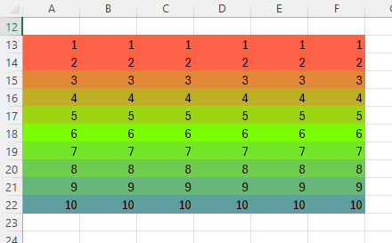

# Conditional formats

## Applying conditional formats

In Excel, a conditional format is a format that is applied if the content of a cell meets some criterion 
but not otherwise. Such conditional formatting is generally straightforward to apply using the 
`setAttribute()` functions or the `setConditionalFormat()` function described here.

!!! note

    In Excel, conditional formats are dynamic. If the cell values change, the formats are updated based 
    on application of the condition to the new values.

    The examples of conditional formatting given here a mix of static and dynamic formats.
    
    Static conditional formats apply formatting based on the current cell values at the time the format 
    is set, but the formats are then static regardless of updates to cell values. They can be updated 
    by re-running the conditional formatting functions described but otherwise remain unchanged. Static 
    formats are created by applying the `setAttribute()` functions described above.

    Dynamic conditional formatting, using the native Excel conditional format functionality, is possible 
    using the `setConditionalFormat()` function, giving access to all of Excel's options. 

## Static conditional formats

As an example, a simple function to set true values in a range to use a bold green font color and 
false values to use a bold red color a could be defined as follows:

```julia
function trueorfalse(sheet, rng) # Use green or red font for true or false respectively
    for c in rng
        if !ismissing(sheet[c]) && sheet[c] isa Bool
            XLSX.setFont(sheet, c, bold=true, color = sheet[c] ? "FF548235" : "FFC00000")
        end
    end
end
```

Applying this function over any range will conditionally color cells green or red if they are 
true or false respectively:

```julia
trueorfalse(sheet, XLSX.CellRange("E3:L6"))
```

Similarly, a function can be defined that fills any cells containing missing values with a grey 
color and have diagonal borders applied:

```julia
function blankmissing(sheet, rng) # Fill with grey and apply both diagonal borders on cells
    for c in rng                  # with missing values
        if ismissing(sheet[c])
            XLSX.setFill(sheet, c; pattern = "solid", fgColor = "lightgrey")
            XLSX.setBorder(sheet, c; diagonal = ["style" => "thin", "color" => "black"])
           end
    end
end
```

This can then be applied to a range of cells to conditionally apply the format:

```julia
blankmissing(sheet, XLSX.CellRange("B3:L6"))
```

## Dynamic conditional formats

XLSX.jl provides a function to create native Excel conditional formats that will be saved 
as part of an `XLSXFile` and which will update dynamically if the values in the cell range 
to which the formatting is applied are subsequently updated.

`XLSX.setConditionalFormat(sheet, CellRange, :type; kwargs...)`

Excel uses a range of `:type` values to describe these conditional formats and the same values 
are used here, as follows:
- `:cellIs`
- `:top10`
- `:aboveAverage`
- `:containsText`
- `:notContainsText`
- `:beginsWith`
- `:endsWith`
- `:timePeriod`
- `:containsErrors`
- `:notContainsErrors`
- `:containsBlanks`
- `:notContainsBlanks`
- `:uniqueValues`
- `:duplicateValues`
- `:expression`
- `:dataBar`
- `:colorScale`
- `:iconSet`

Use of these different `:type`s is illustrated in the following sections.
For more details on the range of `:type` values and their associated keyword 
options, refer to [XLSX.setConditionalFormat()](@ref).

### Cell Value

It is possible to format each cell in a range when the cell's value meets a specified condition using one 
of a number of built-in cell format options or using custom formatting. This group of formatting options 
represents the greatest range of conditional formatting options available in Excel and are probably the most 
often used. All the functions of `Highlight Cells Rules` and `Top/Bottom Rules` are provided.

  

The following `:type` values are used to set conditional formats by making direct comparisons to a cell's value:
- `:cellIs`
- `:top10`
- `:aboveAverage`
- `:containsText`
- `:notContainsText`
- `:beginsWith`
- `:endsWith`
- `:timePeriod`
- `:containsErrors`
- `:notContainsErrors`
- `:containsBlanks`
- `:notContainsBlanks`
- `:uniqueValues`
- `:duplicateValues`

Each of these formatting types needs a set of keyword options to fully define its operation. 
This can be exemplified by considering the `:cellIs` type. Like the other conditional formats 
in this group, `:cellIs` needs an `operator` keyword to define the test to use to determine 
whether or not to apply the formatting. Valid `operator` values for `:cellIs` are:

- `greaterThan`     (cell >  `value`)
- `greaterEqual`    (cell >= `value`)
- `lessThan`        (cell <  `value`)
- `lessEqual`       (cell <= `value`)
- `equal`           (cell == `value`)
- `notEqual`        (cell != `value`)
- `between`         (cell between `value` and `value2`)
- `notBetween`      (cell not between `value` and `value2`)

Each of these need the keyword `value` to be specified and, for `between` and `notBetween`, `value2` 
must also be specified.

Like all the cell value formatting types, `:cellIs` can use one of six built-in Excel formats, as 
illustrated here for the `greaterThan` comparison.


These six built-in formatting options are available by name in XLSX.jl by specifying the `dxStyle` 
keyword with one of the following values:
* `redfilltext`
* `yellowfilltext`
* `greenfilltext`
* `redfill` 
* `redtext`
* `redborder`

Thus, for example, to create a simple `XLSXFile` from scratch and then apply some 
`:cellIs` conditional formats to its cells:

```julia
julia> columns = [ [1, 2, 3, 4], ["Hey", "You", "Out", "There"], [10.2, 20.3, 30.4, 40.5] ]
3-element Vector{Vector}:
 [1, 2, 3, 4]
 ["Hey", "You", "Out", "There"]
 [10.2, 20.3, 30.4, 40.5]

julia> colnames = [ "integers", "strings", "floats" ]
3-element Vector{String}:
 "integers"
 "strings"
 "floats"

julia> f=XLSX.newxlsx()
XLSXFile("C:\...\blank.xlsx") containing 1 Worksheet
            sheetname size          range        
-------------------------------------------------
               Sheet1 1x1           A1:A1

julia> s=f[1]
1×1 XLSX.Worksheet: ["Sheet1"](A1:A1) 

julia> XLSX.writetable!(s, columns, colnames)

julia> s[1:5, 1:3]
5×3 Matrix{Any}:
  "integers"  "strings"    "floats"
 1            "Hey"      10.2
 2            "You"      20.3
 3            "Out"      30.4
 4            "There"    40.5

julia> XLSX.setConditionalFormat(s, "A2:A5", :cellIs;       # Cells with a value > 2 to have red text and light red fill.
                    operator="greaterThan",
                    value="2",
                    dxStyle="redfilltext")
0

julia> XLSX.setConditionalFormat(s, "B2:B5", :containsText; # Cells with text containing "u" to have green text and light green fill.
                    value="u",
                    dxStyle="greenfilltext")
0

julia> XLSX.setConditionalFormat(s, "C2:C5", :top10;        # Cells with values in the top 10% of values in the range to have a red border.
                    operator ="topN%",
                    value="10"
                    dxStyle="redborder")
0

```


Alternatively, it is possible to specify custom format options to match the options offered in Excel 
under the `Custom Format...` option:


!!! note

    In the image above, the font name and size selectors are greyed out.  Excel limits 
    the formatting attributes that can be set in a conditional format. It is not 
    possible to set the size or name of a font and neither is it possible to set any 
    of the cell alignment attributes. Diagonal borders cannot be set either.

    Although it is not a limitation of Excel, for simplicity this function sets all the 
    border attributes for each side of a cell to be the same.

For example, starting with the same simple `XLSXFile` as above, we can apply the following custom formats:

```julia
julia> XLSX.setConditionalFormat(s, "A2:A5", :cellIs;
                   operator="greaterThan",
                   value="2",
                   font=["color" => "coral", "bold"=>"true"],
                   fill=["pattern"=>"solid", "bgColor"=>"cornsilk"],
                   border=["style"=>"dashed", "color"=>"orangered4"],
                   format=["format"=>"0.000"])
0

julia> XLSX.setConditionalFormat(s, "B2:B5", :containsText;
                    value="u",
                    font=["color" => "steelblue4", "italic"=>"true"],
                    fill=["pattern"=>"darkTrellis", "fgColor"=>"lawngreen", "bgColor"=>"cornsilk"],
                    border=["style"=>"double", "color"=>"magenta3"])
0

julia> XLSX.setConditionalFormat(s, "C2:C5", :top10;
                    operator ="topN%",
                    value="10",
                    font=["color" => "magenta3", "strike"=>"true"],
                    fill=["pattern"=>"lightVertical", "fgColor"=>"lawngreen", "bgColor"=>"cornsilk"],
                    border=["style"=>"double", "color"=>"cyan"])
0

julia> XLSX.getConditionalFormats(s)
3-element Vector{Pair{XLSX.CellRange, NamedTuple}}:
 C2:C5 => (type = "top10", priority = 3)
 B2:B5 => (type = "containsText", priority = 2)
 A2:A5 => (type = "cellIs", priority = 1)

```


Each of the conditional format `type`s in the cell value group take similar keyword options but 
the specific details vary for each. For more details, refer to [XLSX.setConditionalFormat()](@ref).

### Expressions

It is possible to use an Excel formula directly to determine whether to apply a conditional format. 
Any expression that evaluates to true or false can be used.


For example, to compare one column with another and apply a conditional format accordingly:

```julia
julia> f=XLSX.newxlsx()
XLSXFile("C:\...\blank.xlsx") containing 1 Worksheet
            sheetname size          range        
-------------------------------------------------
               Sheet1 1x1           A1:A1        

julia> s=f[1]
1×1 XLSX.Worksheet: ["Sheet1"](A1:A1) 

julia> XLSX.writetable!(s, [rand(10), rand(10), rand(10), rand(10)], ["col1", "col2", "col3", "col4"])

julia> s[:]
11×4 Matrix{Any}:
  "col1"     "col2"     "col3"     "col4"
 0.810579   0.13742    0.0146856  0.654739
 0.169043   0.623955   0.713874   0.103253
 0.198619   0.19622    0.0818595  0.863316
 0.353214   0.0949461  0.961917   0.812889
 0.343781   0.0957323  0.061183   0.822921
 0.34115    0.243949   0.527914   0.758945
 0.161748   0.744446   0.119521   0.52732
 0.39707    0.284588   0.501409   0.374944
 0.327938   0.191197   0.943983   0.755799
 0.0314949  0.560541   0.526068   0.45253

julia> XLSX.setConditionalFormat(s, "A2:A10", :expression; formula = "A2>B2", dxStyle = "redfilltext")
0

julia> XLSX.setConditionalFormat(s, "C2:D10", :expression; formula = "C2>\$B2", dxStyle = "greenfilltext")
0
```


Column A uses relative referencing. Columns C and D use an absolute reference for the column but not the 
row of the comparison reference.

The following example uses absolute references on rows and compares the average of each column with the 
average of the preceding column.

```julia
julia> f=XLSX.newxlsx()
XLSXFile("C:\...\blank.xlsx") containing 1 Worksheet
            sheetname size          range
-------------------------------------------------
               Sheet1 1x1           A1:A1

julia> s=f[1]
1×1 XLSX.Worksheet: ["Sheet1"](A1:A1)

julia> XLSX.writetable!(s, [rand(10).*1000, rand(10).*1000, rand(10).*1000, rand(10).*1000], ["2022", "2023", "2024", "2025"])

julia> XLSX.setConditionalFormat(s, "B2:D11", :expression; formula = "average(B\$2:B\$11) > average(A\$2:A\$11)", dxStyle = "greenfilltext")
0

julia> XLSX.setConditionalFormat(s, "B2:D11", :expression; formula = "average(B\$2:B\$11) < average(A\$2:A\$11)", dxStyle = "redfilltext")
0
```


(Row 13 above is the average of each column, calculated in Excel)

When a formula uses relative references, the relative position (offset) of the reference to the base cell in the 
range to which the condition is applied is used consistently throughout the range.
This is illustrated in the following example:

```julia
julia> f=XLSX.newxlsx()
XLSXFile("C:\...\blank.xlsx") containing 1 Worksheet
            sheetname size          range
-------------------------------------------------
               Sheet1 1x1           A1:A1

julia> s=f[1]
1×1 XLSX.Worksheet: ["Sheet1"](A1:A1) 

julia> for i=1:10; for j=1:10; s[i, j] = i*j; end; end

julia> XLSX.setConditionalFormat(s, "A1:E5", :expression; formula = "E5 < 50", dxStyle = "redfilltext")
0
```


The format applied in cell `A1` is determined by comparison of cell `E5` to the value 50. In `B2` it is 
based on cell `F6`, in `C3`, on cell `G7` and so on throughtout the range.

Text based comparisons in Excel are not case sensitive by default, but can be forced to be so:

```julia
julia> f=XLSX.newxlsx()
XLSXFile("C:\...\blank.xlsx") containing 1 Worksheet
            sheetname size          range
-------------------------------------------------
               Sheet1 1x1           A1:A1

julia> s=f[1]
1×1 XLSX.Worksheet: ["Sheet1"](A1:A1)

julia> s[1:3,1:3]="HELLO WORLD"
"HELLO WORLD"

julia> s["A1"] = "Hello World"
"Hello World"

julia> s["B2"] = "Hello World"
"Hello World"

julia> s["C3"] = "Hello World"
"Hello World"

julia> XLSX.setConditionalFormat(s, "A1:A3", :expression; formula = "A1=\"hello world\"", dxStyle = "redfilltext")
0

julia> XLSX.setConditionalFormat(s, "B1:B3", :expression; formula = "B1=\"HELLO WORLD\"", dxStyle = "redfilltext")
0

julia> XLSX.setConditionalFormat(s, "C1:C3", :expression; formula = "exact(\"Hello World\", C1)", dxStyle = "greenfilltext")
0
```


### Data Bar

A `:dataBar` conditional format can be applied to a range of cells.
In Excel there are twelve built-in data bars available, but it is possible 
to customise many elements of these.


In XLSX.jl, the twelve built-in data bars are named as follows 
(layout follows image)

|                |                |                 |                 |
|:--------------:|:--------------:|:---------------:|:---------------:|
| Gradient fill  |    bluegrad    |   greengrad     |    redgrad      |
|                |   orangegrad   |  lightbluegrad  |   purplegrad    |
| Solid fill     |      blue      |     green       |      red        |
|                |     orange     |   lightblue     |    purple       |


Choose one of these data bars by name using the `databar` keyword. If no `databar` 
is specified, `bluegrad` is the default choice. For example

```julia
julia> f=XLSX.newxlsx()
XLSXFile("C:\...\blank.xlsx") containing 1 Worksheet
            sheetname size          range        
-------------------------------------------------
               Sheet1 1x1           A1:A1        

julia> s=f[1]
1×1 XLSX.Worksheet: ["Sheet1"](A1:A1) 

julia> s[1:10, 1]=1:10
1:10

julia> s[1:10, 3]=1:10
1:10

julia> XLSX.setConditionalFormat(s, "A1:A10", :dataBar) # Defaults to `databar="bluegrad"`
0

julia> XLSX.setConditionalFormat(s, "C1:C10", :dataBar; databar="orange")
0

```


All of the options provided by Excel can be adjusted using the provided keyword options. 


For example, the end points of the bar scale can be defined by setting the `min_type` and `max_type` 
keywords to `num` (for an absolute number value), `percent`,  `percentile`, `formula` or `min` or `max`. 
The default type is `automatic`.

For the first three type options, a value must also be given by setting `min_val`, `max_val`.
The value may be taken from a cell by setting `min_val`, `max_val` to a cell reference. When the type is 
set to `formula`, any valid formula yielding a value can be given. Cell references must use absolute referencing.
Types `min` and `max` set the scale endpoints to be exactly the minimum and maximum values of the data in the 
cell range whereas using `automatic` allows Excel flexibility to make minor adjustments to these endpoints, 
e.g. to improve appearance.

```julia
julia> f=XLSX.newxlsx()
XLSXFile("C:\...\blank.xlsx") containing 1 Worksheet
            sheetname size          range
-------------------------------------------------
               Sheet1 1x1           A1:A1

julia> s=f[1]
1×1 XLSX.Worksheet: ["Sheet1"](A1:A1)

julia> s[1:10, 5]=1:10
1:10

julia> s[1:10, 1]=1:10
1:10

julia> s[1:10, 3]=1:10
1:10

julia> XLSX.setConditionalFormat(s, "A1:A10", :dataBar)
0

julia> XLSX.setConditionalFormat(s, "C1:C10", :dataBar; databar="purple", min_type="num", max_type="num", min_val="2", max_val="8")
0

julia> XLSX.setConditionalFormat(s, "E1:E10", :dataBar; databar="greengrad", min_type="percent", max_type="percent", min_val="35", max_val="65")
0
```


Choose whether to hide values using `showVal="false"`, convert a gradient fill to solid (or vice versa) 
with `gradient="false"` (`gradient="true"`) and add borders to data bars with `borders="true"`.

```julia
julia> XLSX.setConditionalFormat(s, "A1:A10", :dataBar)
0

julia> XLSX.setConditionalFormat(s, "C1:C10", :dataBar, showVal="false", gradient="false")
0

julia> XLSX.setConditionalFormat(s, "E1:E10", :dataBar; databar=purple,  borders="true", gradient="true")
0
```


Change bar colors using `fill_col=` and border colors using `border_col=`. Colors are specified using an 8-digit hexadecimal as `"FFRRGGBB"` or using any named color from [Colors.jl](https://juliagraphics.github.io/Colors.jl/stable/namedcolors/).

By default, negative values are shown with red bars and borders. Override these defaults by setting `sameNegFill = "true"`and `sameNegBorders="true"` to use the same colors as positive bars. Alternatively, to use any available color, set `neg_fill_col=` and `neg_border_col=`.

```julia
julia> XLSX.setConditionalFormat(s, "A1:A11", :dataBar)
0

julia> XLSX.setConditionalFormat(s, "C1:C11", :dataBar; sameNegFill="true", sameNegBorders="true")
0

julia> XLSX.setConditionalFormat(s, "E1:E11", :dataBar; fill_col="cyan", border_col="blue", neg_fill_col="lemonchiffon1", neg_border_col="goldenrod4")
0

```


By default, Excel positions the axis automatically, based on the range of the cell data. 
Control the location of the axis using `axis_pos = "middle"` to locate it in the middle 
of the column width or `axis_pos = "none"` to remove the axis. Excel chooses the direction 
of the bars according to the context of the cell data. Force (postive) bars to go `leftToRight` 
or `rightToLeft` using the `direction` key word. Change the color of the axis with `axis_col`.

```julia
julia> s[1:10, 1]=1:10
1:10

julia> s[1:10,3]=-5:4
-5:4

julia> s[1:10,5]=1:10
1:10

julia> XLSX.setConditionalFormat(s, "A1:A10", :dataBar)
0

julia> XLSX.setConditionalFormat(s, "C1:C10", :dataBar; direction="rightToLeft", axis_pos="middle", axis_col="magenta")
0

julia> XLSX.setConditionalFormat(s, "E1:E10", :dataBar; direction="leftToRight", min_type="num", min_val="-5", axis_pos="none")
0

```


### Color Scale

It is possible to apply a `:colorScale` formatting type to a range of cells.
In Excel there are twelve built-in color scales available, but it is possible to create 
custom color scales, too.


In XLSX.jl, the twelve built-in scales are named by their end/mid/start colors as follows 
(layout follows image)

|                  |                  |                 |                 |
|:----------------:|:----------------:|:---------------:|:---------------:|
|  greenyellowred  |  redyellowgreen  |  greenwhitered  |  redwhitegreen  |
|   bluewhitered   |   redwhiteblue   |    whitered     |    redwhite     |
|    greenwhite    |    whitegreen    |   greenyellow   |   yellowgreen   |

The default colorscale is `greenyellow`. To use a different built-in color scale, 
specify the name using the keyword `colorscale`, thus:

```julia
julia> XLSX.setConditionalFormat(f["Sheet1"], "A1:F12", :colorScale) # Defaults to the `greenyellow` built-in scale.
0

julia> XLSX.setConditionalFormat(f["Sheet1"], "A13:C18", :colorScale; colorscale="whitered")
0

julia> XLSX.setConditionalFormat(f["Sheet1"], "D13:F18", :colorScale; colorscale="bluewhitered")
0
```

A custom color scale may be defined by the colors at each end of the scale and (optionally) by some 
mid-point color, too. Colors can be specified using hex RGB values or by name using any of the colors
in [Colors.jl](https://juliagraphics.github.io/Colors.jl/stable/namedcolors/).

In Excel, the colorScale options (for a 3 color scale) look like this:


The end points (and optional mid-point) can be defined using an absolute number (`num`), a `percent`, 
a `percentile` or as a `min` or `max`. For the first three options, a value must also be given.
The value may be taken from a cell by setting `min_val`, `mid_val` or `max_val` to a cell reference.
Thus, you can apply a custom 3-color scale using, for example:

```julia
julia> XLSX.setConditionalFormat(f["Sheet1"], "A13:F22", :colorScale;
            min_type="num", 
            min_val="2",
            min_col="tomato",
            mid_type="num",
            mid_val="6", 
            mid_col="lawngreen",
            max_type="num",
            max_val="10",
            max_col="cadetblue"
        )
0
```


### Icon Set

It is possible to apply an `:iconSet` formatting type to a range of cells.
In Excel there are twenty built-in icon sets available, but it is possible to 
create a custom icon set from the 52 built-in icons, too.


In XLSX.jl, the twenty built-in icon sets are named as follows 
(layout follows image)

|                |                |                 |
|:--------------:|:--------------:|:---------------:|
| Directional    |    3Arrows     |  3ArrowsGray    |
|                |   3Triangles   |  4ArrowsGray    |
|                |    4Arrows     |  5ArrowsGray    |
|                |    5Arrows     |                 |
| Shapes         | 3TrafficLights | 3TrafficLights2 |
|                |    3Signs      | 4TrafficLights  |
|                |  4BlackToRed   |                 |
| Indicators     |   3Symbols     |   3Symbols2     | 
|                |    3Flags      |                 |
| Ratings        |    3Stars      |   4Ratings      |
|                |   5Quarters    |   5Ratings      |
|                |    5Boxes      |                 |

Choose one of these icon sets by name using the `iconset` keyword. If no `iconset` 
is specified, `3TrafficLights` is the default choice. For example

```julia
julia> f=XLSX.newxlsx()
XLSXFile("C:\...\blank.xlsx") containing 1 Worksheet
            sheetname size          range        
-------------------------------------------------
               Sheet1 1x1           A1:A1        

julia> s=f[1]
1×1 XLSX.Worksheet: ["Sheet1"](A1:A1) 

julia> s[1:10, 1]=1:10
1:10

julia> XLSX.setConditionalFormat(s, "A1:A10", :iconSet)
0
```


All of the options to control an iconSet in Excel are available. The iconSet options 
(for a 4-icon set) look like this:


Each icon set includes a default set of thresholds defining which symbol to use. These 
relate the cell value to the range of values in the cell range to which the conditional 
format is being applied. This can be illustrated (for a 4-icon set) as follows:

```
 Range     ┌─────────────────┬─────────────────┬─────────────────┬────────────────┐   Range
 Minimum ->│     Icon 1      │     Icon 2      │     Icon 3      │     Icon 4     │<- Maximum
                         `min_val`         `mid_val`         `max_val`
                         threshold         threshold         threshold
``` 
The starting value for the first icon is always the minimum value of the range, and the stopping
value for the last icon is always the maximum value in the range. No cells will have values for 
which an icon cannot be assigned. The internal thresholds for transition from one icon to the 
next are defined (in a 3-icon set) by `min_val` and `max_val`. In a 4-icon set, an additional 
threshold, `mid-val`, is required and in a 5-icon set, `mid2_val` is needed as well.

The type of these thresholds can be defined in terms of `percent` (of the range), `percentile` 
or simply with a `num` (number) (e.g. as `min_type="percent"`). For each threshold, 
the value can either be given as a number (as a String) or as a simple cell reference. 
Alternatively, specifying the type as `formula` allows the value to be determined by any 
valid Excel formula.

!!! note

    Cell references used to define threshold values in an iconSet MUST always be given as absolute 
    cell references (e.g. `"\$A\$4"`). Relative references should not be used.

Using the example above, change both the type and value of the thresholds like this:

```julia
julia> XLSX.setConditionalFormat(s, "A1:A10", :iconSet;
            min_type="num", max_type="num", 
            min_val="2", max_val="9")
0
```


To suppress the values in cells and just show the icons, use `showVal="false"`, to reverse the icon ordering 
use `reverse="true"` and to change the default comparison from `>=` to `>` set `min_gte="false"` (and 
equivalent for mid, mid2 and max):
```julia
julia> XLSX.writetable!(s, [collect(1:10), collect(1:10), collect(1:10), collect(1:10)],
            ["normal", "showVal=\"false\"", "reverse=\"true\"", "min_gte=\"false\""])

julia> XLSX.setConditionalFormat(s, "A2:A11", :iconSet;
            min_type="num",  max_type="num",
            min_val="3",     max_val="8")
0

julia> XLSX.setConditionalFormat(s, "B2:B11", :iconSet;
            min_type="num",  max_type="num",
            min_val="3",     max_val="8",
            showVal="false")
0

julia> XLSX.setConditionalFormat(s, "C2:C11", :iconSet;
            min_type="num",  max_type="num",
            min_val="3",     max_val="8",
            reverse="true")
0

julia> XLSX.setConditionalFormat(s, "D2:D11", :iconSet;
            min_type="num",  max_type="num",
            min_val="3",     max_val="8",
            min_gte="false", max_gte="false")
0
```


Create a custom icon set by specifying `iconset="Custom"`. The icons to use in the custom set are 
defined with `icon_list` keyword, which takes a vector of integers defining which of the 52 built 
in icons to use. Use of the val and type keywords dictate the number of icons to use. If `mid_type` 
and `mid_val` are both defined, but not `mid2_val` or `mid2_type`, then a 4-icon set will be used. 
If both sets of keywords are defined, a 5-icon set is used and if neither is set, a 3-icon set will 
be used.

This is illustrated with code below, which produces a key defining which integer to use 
in `icon_list` to represent any desired icon:
```julia
using XLSX
f=XLSX.newxlsx()
s=f[1]
for i = 0:3
    for j=1:13
        s[i+1,j]=i*13+j
    end
end
for j=1:13
     XLSX.setConditionalFormat(s, 1:4, j, :iconSet; # Create a custom 4-icon set in each column.
        iconset="Custom",
        icon_list=[j, 13+j, 26+j, 39+j],
        min_type="percent", mid_type="percent", max_type="percent",
        min_val="25", mid_val="50", max_val="75"
        )
end
XLSX.setColumnWidth(s, 1:13, width=6.4)
XLSX.setRowHeight(s, 1:4, height=27.75)
XLSX.setAlignment(s, "A1:M4", horizontal="center", vertical="center")
XLSX.setBorder(s, "A1:M4", allsides = ["style"=>"thin","color"=>"black"])
XLSX.writexlsx("iconKey.xlsx", f, overwrite=true)
```


Specifying too few icons in `icon_list` throws an error while any extra will simply be ignored.

## Cell references in conditional formats

### Cell Ranges

Cell ranges for conditional formats are always absolute refences. The specified range to which a 
conditional format is to be applied is always treated as being based upon absolute cell references 
so that, for example
```julia
julia> XLSX.setConditionalFormat(s, "A2:C5", :colorScale; colorscale="greenyellow")
```
will be converted automatically to the range "\$A\$2:\$C\$5" by Excel itself. There is therefore no need to specify 
absolute cell ranges when calling `setCondtionalFormat()`

### Relative and absolute cell references

Cell references used to specify `value` or `value2` or in any `formula` (for `:expression` type 
conditional formats only) may be either absolute or relative. As in Excel, an absolute reference 
is defined using a `$` prefix to either or both the row or the column part of the cell reference 
but here the `$` must be appropriately escaped. Thus:

```julia
value = "B2"          # relative reference
value = "\$B\$2"      # (escaped) absolute reference
```

The cell used in a comparison is adjusted for each cell in the range if a relative reference is used. This is 
illustrated in the following example. Cells in column A are referenced to column B using a relative reference,
meaning `A2` is compared with `B2` but `A3` is compared with `B3` and so on until `A5` is compared with `B5`.
In contrast, column B is referenced to cell `C2` using an absolute reference. Each cell in column B is compared 
with cell `C2`.

```julia
julia> f=XLSX.newxlsx()
XLSXFile("C:\...\blank.xlsx") containing 1 Worksheet
            sheetname size          range
-------------------------------------------------
               Sheet1 1x1           A1:A1

julia> s=f[1]
1×1 XLSX.Worksheet: ["Sheet1"](A1:A1)

julia> col1=rand(5)
5-element Vector{Float64}:
 0.6283728884101448
 0.7516580026008692
 0.2738854683970795
 0.13517788102005834
 0.4659468387663539

julia> col2=rand(5)
5-element Vector{Float64}:
 0.7582186445697804
 0.739539172599636
 0.4389109821689414
 0.14156225872248773
 0.10715394525726485

julia> XLSX.writetable!(s, [col1, col2],["col1", "col2"])

julia> s["C2"]=0.5
0.5

julia> s[:]
6×3 Matrix{Any}:
  "col1"    "col2"    missing
 0.628373  0.758219  0.5
 0.751658  0.739539   missing
 0.273885  0.438911   missing
 0.135178  0.141562   missing
 0.465947  0.107154   missing

julia> XLSX.setConditionalFormat(s, "A2:A6", :cellIs; operator="greaterThan", value="B2", dxStyle="redfilltext")
0

julia> XLSX.setConditionalFormat(s, "B2:B6", :cellIs; operator="greaterThan", value="\$C\$2", dxStyle="greenfilltext")
0

```


!!! note

    It is not possible to use relative cell references in conditional format types `:dataBar`, 
    `:colorScale` or `:iconSet`.

!!! note

    Excel permits cell references to cells in other sheets for comparisons in conditional formats
    (e.g. "OtherSheet!A1"), but this is handled differently internally than references within the 
    same sheet. This functionality is not universally implemented in XLSX.jl yet. 

### Overlaying conditional formats

It is possible to overlay multiple conditional formats over each other in a 
cell range or even in different, overlapping cell ranges. Starting with a table of 
integers, we can apply three different conditional formats sequentially. Excel applies 
these in priority order (priority 1 is higher priority than priority 2) which is the 
same as the order in which they were defined with `setConditionalFormat`.

```julia
julia> s[1:5, 1:3]
5×3 Matrix{Any}:
   "first"    "middle"    "last"
  1         15           9
 12          6          10
  3         17          11
 14          8           2

julia> XLSX.setConditionalFormat(f["Sheet1"], "A2:C5", :colorScale; colorscale="greenyellowred")
0

julia> XLSX.setConditionalFormat(s, "A2:C5", :top10;
                    operator ="topN",
                    value="3",
                    font=["color"=>"magenta3", "strike"=>"true"],
                    fill=["pattern"=>"lightVertical", "fgColor"=>"lawngreen", "bgColor"=>"cornsilk"],
                    border=["style"=>"double", "color"=>"cyan"])
0

julia> XLSX.setConditionalFormat(s, "A2:A5", :cellIs;
                   operator="lessThan",
                   value="2",
                   font=["color"=>"coral", "bold"=>"true"],
                   fill=["pattern"=>"lightHorizontal", "fgColor"=>"cornsilk"],
                   border=["style"=>"dashed", "color"=>"orangered4"])
0

julia> XLSX.getConditionalFormats(s)
3-element Vector{Pair{XLSX.CellRange, NamedTuple}}:
 A2:A5 => (type = "cellIs", priority = 3)
 A2:C5 => (type = "colorScale", priority = 1)
 A2:C5 => (type = "top10", priority = 2)

```


When applying multiple overlayed formats, it is possible to make the formatting stop if any cell meets 
one of the conditions, so that lower proirity conditional formats are not applied to that cell. This is 
achieved with the `stopIfTrue` keyword. It is not possible to apply `stopIfTrue` to `:dataBar`, 
`:colorScale` or `:iconSet` types.

The example below illustrates how `stopIfTrue` is used to stop further conditional formats from being 
applied to cells to which red borders are applied:

```julia
julia> s[1:5, 1:3]
5×3 Matrix{Any}:
   "first"    "middle"    "last"
  1         15           9
 12          6          10
  3         17          11
 14          8           2

julia> XLSX.setConditionalFormat(s, "A2:C5", :cellIs; # No further conditions will be evaluated if this condition is met.
                    operator ="greaterThan",
                    value="9",
                    stopIfTrue="true",
                    dxStyle = "redborder")
0

julia> XLSX.setConditionalFormat(s, "A2:C5", :top10;  # Won't apply if the max value in the range is > 9.
                    operator ="topN",
                    value="1",
                    dxStyle = "redfilltext")
0

julia> XLSX.setConditionalFormat(s, "A2:C5", :colorScale; colorscale="greenyellow") # Won't apply to any cell with a value > 9
0
```


Overlaying the same three conditional formats without setting the `stopIfTrue` option 
will result in the following, instead:


It is possible to overlay `:colorScale`s, `:dataBar`s and `:iconSet`s in the same or 
overlapping cell ranges.

```juliaf=XLSX.newxlsx()
julia> 
XLSXFile("C:\...\blank.xlsx") containing 1 Worksheet
            sheetname size          range
-------------------------------------------------
               Sheet1 1x1           A1:A1

julia> s=f[1]
1×1 XLSX.Worksheet: ["Sheet1"](A1:A1)

julia> XLSX.writetable!(s, [rand(10),rand(10),rand(10),rand(10),rand(10),rand(10),rand(10)],["col1","col2","col3","col4","col5","col6","col7"])

julia> XLSX.setConditionalFormat(s, "A5:E8", :dataBar; direction="rightToLeft")
0

julia> XLSX.setConditionalFormat(s, "C5:G8", :iconSet; iconset="5Arrows")
0

julia> XLSX.setConditionalFormat(s, "C2:E11", :colorScale; colorscale="greenyellowred")
0

julia> XLSX.setFormat(s, "A2:G11"; format="#0.00")
-1

``` 


