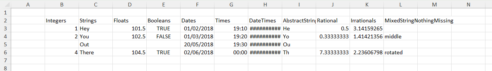
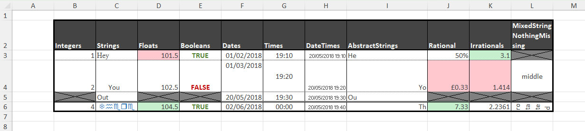

# Examples

## Applying cell format to an existing table

Consider a simple table, created from scratch, like this:

```julia
using XLSX
using Dates

# First create some data in an empty XLSXfile
xf = XLSX.newxlsx()
sheet = xf["Sheet1"]

col_names = ["Integers", "Strings", "Floats", "Booleans", "Dates", "Times", "DateTimes", "AbstractStrings", "Rational", "Irrationals", "MixedStringNothingMissing"]
data = Vector{Any}(undef, 11)
data[1] = [1, 2, missing, UInt8(4)]
data[2] = ["Hey", "You", "Out", "There"]
data[3] = [101.5, 102.5, missing, 104.5]
data[4] = [true, false, missing, true]
data[5] = [Date(2018, 2, 1), Date(2018, 3, 1), Date(2018, 5, 20), Date(2018, 6, 2)]
data[6] = [Dates.Time(19, 10), Dates.Time(19, 20), Dates.Time(19, 30), Dates.Time(0, 0)]
data[7] = [Dates.DateTime(2018, 5, 20, 19, 10), Dates.DateTime(2018, 5, 20, 19, 20), Dates.DateTime(2018, 5, 20, 19, 30), Dates.DateTime(2018, 5, 20, 19, 40)]
data[8] = SubString.(["Hey", "You", "Out", "There"], 1, 2)
data[9] = [1 // 2, 1 // 3, missing, 22 // 3]
data[10] = [pi, sqrt(2), missing, sqrt(5)]
data[11] = [nothing, "middle", missing, "rotated"]

XLSX.writetable!(
    sheet,
    data,
    col_names;
    anchor_cell=XLSX.CellRef("B2"),
    write_columnnames=true,
)

XLSX.writexlsx("mytable_unformatted.xlsx", xf, overwrite=true)
```

By default, this table will look like this in Excel:



We can apply some formatting choices to change the table's appearance:



This is achieved with the following code:

```julia
# Cell borders
XLSX.setUniformBorder(sheet, "B2:L6";
    top    = ["style" => "hair", "color" => "FF000000"],
    bottom = ["style" => "hair", "color" => "FF000000"],
    left   = ["style" => "thin", "color" => "FF000000"],
    right  = ["style" => "thin", "color" => "FF000000"]
)
XLSX.setBorder(sheet, "B2:L2"; bottom = ["style" => "medium", "color" => "FF000000"]) 
XLSX.setBorder(sheet, "B6:L6"; top = ["style" => "double", "color" => "FF000000"])
XLSX.setOutsideBorder(sheet, "B2:L6"; outside = ["style" => "thick", "color" => "FF000000"])

# Cell fill
XLSX.setFill(sheet, "B2:L2"; pattern = "solid", fgColor = "FF444444")

# Cell fonts
XLSX.setFont(sheet, "B2:L2"; bold=true, color = "FFFFFFFF")
XLSX.setFont(sheet, "B3:L6"; color = "FF444444")
XLSX.setFont(sheet, "C3"; name = "Times New Roman")
XLSX.setFont(sheet, "C6"; name = "Wingdings", color = "FF2F75B5")

# Cell alignment
XLSX.setAlignment(sheet, "L2"; wrapText = true)
XLSX.setAlignment(sheet, "I4"; horizontal="right")
XLSX.setAlignment(sheet, "I6"; horizontal="right")
XLSX.setAlignment(sheet, "C4"; indent=2)
XLSX.setAlignment(sheet, "F4"; vertical="top")
XLSX.setAlignment(sheet, "G4"; vertical="center")
XLSX.setAlignment(sheet, "L4"; horizontal="center", vertical="center")
XLSX.setAlignment(sheet, "G3:G6"; horizontal = "center")
XLSX.setAlignment(sheet, "H3:H6"; shrink = true)
XLSX.setAlignment(sheet, "L6"; horizontal = "center", rotation = 90, wrapText=true)

# Row height and column width
XLSX.setRowHeight(sheet, "B4"; height=50)
XLSX.setRowHeight(sheet, "B6"; height=15)
XLSX.setColumnWidth(sheet, "I"; width = 20.5)

# Conditional formatting
function blankmissing(sheet, rng) # Fill with grey and apply both diagonal borders on cells
    for c in rng                  # with missing values
        if ismissing(sheet[c])
            XLSX.setFill(sheet, c; pattern = "solid", fgColor = "grey")
            XLSX.setBorder(sheet, c; diagonal = ["style" => "thin", "color" => "black"])
           end
    end
end
function trueorfalse(sheet, rng) # Use green or red font for true or false respectively
    for c in rng
        if !ismissing(sheet[c]) && sheet[c] isa Bool
            XLSX.setFont(sheet, c, bold=true, color = sheet[c] ? "FF548235" : "FFC00000")
        end
    end
end
function redgreenminmax(sheet, rng) # Fill light green / light red the cell with maximum / minimum value
    mn, mx = extrema(x for x in sheet[rng] if !ismissing(x))
    for c in rng
        if !ismissing(sheet[c])
            if sheet[c] == mx
               XLSX.setFill(sheet, c; pattern = "solid", fgColor = "FFC6EFCE")
            elseif sheet[c] == mn
                XLSX.setFill(sheet, c; pattern = "solid", fgColor = "FFFFC7CE")
            end
        end
    end
end

blankmissing(sheet, XLSX.CellRange("B3:L6"))
trueorfalse(sheet, XLSX.CellRange("B2:L6"))
redgreenminmax(sheet, XLSX.CellRange("D3:D6"))
redgreenminmax(sheet, XLSX.CellRange("J3:J6"))
redgreenminmax(sheet, XLSX.CellRange("K3:K6"))

# Number formats
XLSX.setFormat(sheet, "J3"; format = "Percentage")
XLSX.setFormat(sheet, "J4"; format = "Currency")
XLSX.setFormat(sheet, "J6"; format = "Number")
XLSX.setFormat(sheet, "K3"; format = "0.0")
XLSX.setFormat(sheet, "K4"; format = "0.000")
XLSX.setFormat(sheet, "K6"; format = "0.0000")

# Save to an actual XLSX file
XLSX.writexlsx("mytable_formatted.xlsx", xf, overwrite=true)
```

## Creating a formatted form

There is a file, customXml.xlsx, in the \data folder of this project that looks like a template 
file - a form to be filled in. The code below creates this form from scratch and makes 
extensive use of vector indexing for rows and columns and of non-contiguous ranges:

```julia
using XLSX

f = XLSX.newxlsx()
s = f[1]
s["A1:K116"] = ""

s["B2"] = "Catalogue Entry Form"

s["B5"] = "User Data"
s["B7"] = "Recipient ID"
s["B9"] = "Recipient Name"
s["B11"] = "Address 1"
s["B12"] = "Address 2"
s["B13"] = "Address 3"
s["B14"] = "Town"
s["B16"] = "Postcode"
s["B18"] = "Ward"
s["B20"] = "Region"
s["H18"] = "Local Authority"
s["H20"] = "UK Constituency"
s["B22"] = "GrantID"
s["D22"] = "Grant Date"
s["F22"] = "Grant Amount"
s["H22"] = "Grant Title"
s["J22"] = "Distributor"
s["B32"] = "Distributor"

s["B30"] = "Creator"
s["B34"] = "Created by"
s["D36"] = "Email"
s["H36"] = "Phone"
s["B38"] = "Grant Manager"
s["D40"] = "Email"
s["H40"] = "Phone number"

s["B43"] = "Summary"
s["B45"] = "Summary ID"
s["H45"] = "Date Created"
s["B47"] = "Summary Name"
s["B49"] = "Headline"
s["B51"] = "Short Description"
s["B55"] = "Long Description"
s["B62"] = "Quote 1"
s["D65"] = "Quote Attribution"
s["H65"] = "Quote Date"
s["B67"] = "Quote 2"
s["D70"] = "Quote Attribution"
s["H70"] = "Quote Date"
s["B72"] = "Keywords"
s["B74"] = "Website"
s["B76"] = "Social media handles"
s["D76"] = "Twitter"
s["D78"] = "Facebook"
s["D80"] = "Instagram"
s["H76"] = "LinkedIn"
s["H78"] = "TikTok"
s["H80"] = "YouTube"
s["B82"] = "Image 1 filename"
s["D84"] = "Alt-Text"
s["D86"] = "Image Attribution"
s["D88"] = "Image Date"
s["D90"] = "Confirm permission to use image"
s["B92"] = "Image 2 filename"
s["D94"] = "Alt-Text"
s["D96"] = "Image Attribution"
s["D98"] = "Image Date"
s["D100"] = "Confirm permission to use image"

s["B103"] = "Penultimate category"
s["B105"] = "Competition Details"
s["D105"] = "Last year of entry"
s["D107"] = "Year of last win"
s["H105"] = "Categories of entry"
s["H107"] = "Categories of win"

s["B110"] = "Last category"
s["B112"] = "Use for Comms"
s["D112"] = "Comms Priority"
s["F112"] = "Comms End Date"

XLSX.setColumnWidth(s, 1:2:11; width=1.3)
XLSX.setColumnWidth(s, 2:2:10; width=18)
XLSX.setRowHeight(s, :; height=15)
XLSX.setRowHeight(s, [3, 4, 19, 28, 29, 35, 39, 41, 42, 64, 69, 77, 79, 83, 85, 87, 89, 93, 95, 97, 99, 101, 102, 106, 108, 109, 116]; height=5.5)
XLSX.setRowHeight(s, [5, 30, 43, 103, 110]; height=18)
XLSX.setRowHeight(s, 2; height=23)

XLSX.setFont(s, "B2"; size=18, bold=true)
XLSX.setUniformFont(s, [5, 30, 43, 103, 110], 2; size=14, bold=true)

XLSX.setUniformFill(s, [1, 2, 3, 4, 5, 6, 8, 10, 15, 17, 19, 21, 28, 29, 30, 31, 33, 35, 37, 39, 41, 42, 43, 44, 46, 48, 50, 52, 53, 54, 56, 57, 58, 59, 60, 61, 63, 64, 66, 68, 69, 71, 73, 75, 77, 79, 81, 83, 85, 87, 89, 91, 93, 95, 97, 99, 101, 102, 103, 104, 106, 108, 109, 110, 111, 115, 116], :; pattern="solid", fgColor="lightgrey")
XLSX.setUniformFill(s, :, [1, 3, 5, 7, 9, 11]; pattern="solid", fgColor="lightgrey")
XLSX.setFill(s, "F7,H7,J7,J9,H11:J16,F14,F16:F20,H32:J32,B36,B40,F45,J47:J49,B65,B70,B78:B80,B84:B90,B94:B100,H88:J90,H98:J100,B107,F114,H112:J115"; pattern="solid", fgColor="lightgrey")
XLSX.setFill(s, "D18,D20,J18,J20,D45"; pattern="solid", fgColor="darkgrey")
XLSX.setFill(s, "B112:B114,D112:D115"; pattern="solid", fgColor="white")
XLSX.setFill(s, "E90,E100,D115"; pattern="none")

XLSX.mergeCells(s, "D9:H9")
XLSX.mergeCells(s, "D11:G11,D12:G12,D13:G13")
XLSX.mergeCells(s, "D32:F32,D34:J34,D38:J38")
XLSX.mergeCells(s, "D47:H47,D49:H49")
XLSX.mergeCells(s, "D51:J53,D55:J60")
XLSX.mergeCells(s, "D62:J63,D67:J68")
XLSX.mergeCells(s, "D72:J72,D74:J74")
XLSX.mergeCells(s, "D82:J82,F84:J84,F86:J86")
XLSX.mergeCells(s, "D92:J92,F94:J94,F96:J96")

XLSX.setAlignment(s, "D51:J53,D55:J60,D62:J63,D67:J68"; vertical="top", wrapText=true)

XLSX.setBorder(s, "A1:K3"; outside = ["style" => "medium", "color" => "black"])
XLSX.setBorder(s, "A4:K28"; outside = ["style" => "medium", "color" => "black"])
XLSX.setBorder(s, "A29:K41"; outside = ["style" => "medium", "color" => "black"])
XLSX.setBorder(s, "A42:K101"; outside = ["style" => "medium", "color" => "black"])
XLSX.setBorder(s, "A102:K108"; outside = ["style" => "medium", "color" => "black"])
XLSX.setBorder(s, "A109:K116"; outside = ["style" => "medium", "color" => "black"])

XLSX.setBorder(s, "B7:D7,B9:H9"; allsides = ["style" => "thin", "color" => "black"])
XLSX.setBorder(s, "B11:G13,B14:D14,B16:D16"; allsides = ["style" => "thin", "color" => "black"])
XLSX.setBorder(s, "B18:D18,B20:D20,H18:J18,H20:J20"; allsides = ["style" => "thin", "color" => "black"])
XLSX.setUniformBorder(s, "B22:J27"; allsides = ["style" => "thin", "color" => "black"])

XLSX.setBorder(s, "B32:F32"; allsides = ["style" => "thin", "color" => "black"])
XLSX.setBorder(s, "B34:C34,D34:J34,D36:F36,H36:J36"; allsides = ["style" => "thin", "color" => "black"])
XLSX.setBorder(s, "B38:C38,D38:J38,D40:F40,H40:J40"; allsides = ["style" => "thin", "color" => "black"])
XLSX.setBorder(s, "D34:J36,D38:J40"; outside = ["style" => "thin", "color" => "black"])

XLSX.setBorder(s, "B45:D45,H45:J45"; allsides = ["style" => "thin", "color" => "black"])
XLSX.setBorder(s, "B47:H47,B49:H49"; allsides = ["style" => "thin", "color" => "black"])
XLSX.setBorder(s, "B51:C51,B55:C55"; allsides = ["style" => "thin", "color" => "black"])
XLSX.setBorder(s, "D51:J53,D55:J60"; outside = ["style" => "thin", "color" => "black"])

XLSX.setBorder(s, "B62:C62,D65:F65,H65:J65"; allsides = ["style" => "thin", "color" => "black"])
XLSX.setBorder(s, "B67:C67,D70:F70,H70:J70"; allsides = ["style" => "thin", "color" => "black"])
XLSX.setBorder(s, "D62:J63,D67:J68"; allsides = ["style" => "thin", "color" => "black"])
XLSX.setBorder(s, "D62:J65,D67:J70"; outside = ["style" => "thin", "color" => "black"])

XLSX.setBorder(s, "B72:J72,B74:J74"; allsides = ["style" => "thin", "color" => "black"])

XLSX.setBorder(s, "B76:F76,H76:J76,D78:F78,H78:J78,D80:F80,H80:J80"; allsides = ["style" => "thin", "color" => "black"])
XLSX.setBorder(s, "D76:J80"; outside = ["style" => "thin", "color" => "black"])

XLSX.setBorder(s, "B82:J82,D84:J84,D86:J86,D88:F88,D90:F90"; allsides = ["style" => "thin", "color" => "black"])
XLSX.setBorder(s, "D82:J90"; outside = ["style" => "thin", "color" => "black"])
XLSX.setBorder(s, "B92:J92,D94:J94,D96:J96,D98:F98,D100:F100"; allsides = ["style" => "thin", "color" => "black"])
XLSX.setBorder(s, "D92:J100"; outside = ["style" => "thin", "color" => "black"])

XLSX.setBorder(s, "B105:F105,H105:J105,D107:F107,H107:J107"; allsides = ["style" => "thin", "color" => "black"])
XLSX.setBorder(s, "D105:J107"; outside = ["style" => "thin", "color" => "black"])

XLSX.setBorder(s, "F112,F113"; allsides = ["style" => "thin", "color" => "black"])
XLSX.setBorder(s, "B112:B114,D112:D115"; outside = ["style" => "thin", "color" => "black"])

XLSX.writexlsx("myNewTemplate.xlsx", f, overwrite=true)
```