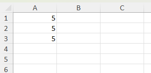
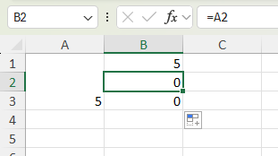
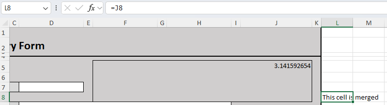

# Working with merged cells

Worksheets may contain merged cells. XLSX.jl provides functions to identify the merged cells in a worksheet, 
to determine if a cell is part of a merged range and to determine the value of a merged cell range from any 
cell in that range.

```julia

julia> using XLSX

julia> f=XLSX.opentemplate("customXml.xlsx")
XLSXFile("customXml.xlsx") containing 2 Worksheets
            sheetname size          range        
-------------------------------------------------
              Mock-up 116x11        A1:K116
     Document History 17x3          A1:C17

julia> XLSX.getMergedCells(f[1])
25-element Vector{XLSX.CellRange}:
 D49:H49
 D72:J72
 F94:J94
 F96:J96
 F84:J84
 F86:J86
 D62:J63
 D51:J53
 D55:J60
 D92:J92
 D82:J82
 D74:J74
 D67:J68
 D47:H47
 D9:H9
 D11:G11
 D12:G12
 D14:E14
 D16:E16
 D32:F32
 D38:J38
 D34:J34
 D18:E18
 D20:E20
 D13:G13

julia> XLSX.isMergedCell(f[1], "D13")
true

julia> XLSX.isMergedCell(f[1], "H13")
false

julia> XLSX.getMergedBaseCell(f[1], "E18") # E18 is a merged cell. The base cell in the merged range is D18.
(baseCell = D18, baseValue = "Here") # The base cell in the merged range is D18 and it's value is "Here".
```

It is also possible to create new merged cells:

```julia

julia> XLSX.isMergedCell(f[1], "F5")
false

julia> XLSX.isMergedCell(f[1], "J8")
false

julia> XLSX.mergeCells(s, "F5:J8")

julia> s["F5"] = pi
π = 3.1415926535897...

julia> XLSX.isMergedCell(f[1], "J8")
true

julia> XLSX.isMergedCell(f[1], "F5")
true

julia> XLSX.getMergedBaseCell(f[1], "J8")
(baseCell = F5, baseValue = 3.141592653589793)
```

It is not allowed to create new merged cells that overlap at all with any existing merged cells.

!!! warning

    It is possible to write into any merged cell using `XLSX.jl`, even those that are not the 
    base cell of the merged range. This is illustrated below:

    ```julia

    julia> using XLSX

    julia> f=XLSX.newxlsx()
    XLSXFile("C:\...\blank.xlsx") containing 1 Worksheet
                sheetname size          range        
    -------------------------------------------------
                Sheet1 1x1           A1:A1        


    julia> s=f[1]
    1×1 XLSX.Worksheet: ["Sheet1"](A1:A1) 

    julia> s["A1:A3"]=5
    5
    ```

    This produces the simple sheet shown.

    

    Merging the three cells `A1:A3` sets the cells `A2` and `A3` to missing just as Excel does.

    ```
    julia> s["A1"]
    5

    julia> s["A2"]
    5

    julia> s["A3"]
    5

    julia> XLSX.mergeCells(s, "A1:A3")
    0

    julia> s["A1"]
    5

    julia> s["A2"]
    missing

    julia> s["A3"]
    missing
    ```

    

    However, even after the merge, it is possible to explicitly write into the merged cells. 
    These written values will not be visible in Excel but can still be accessed by reference.

    ```
    julia> s["A2"]="text here now"
    "text here now"

    julia> s["A1"]
    5

    julia> s["A2"]
    "text here now"

    julia> s["A3"]
    missing

    julia> XLSX.getMergedBaseCell(s, "A2")
    (baseCell = A1, baseValue = 5)

    ```

    The cell `A2` remains merged, and this is how Excel displays it. The assigned cell value 
    won't be visible in Excel, but it can be referenced in a formula as shown here, where 
    cell `B2` references cell `A2` in its formula ("=A2"):

    
    
    Assigning values to cells in a merged range like this is prevented in Excel itself by the UI 
    although it is possible using VBA. There is currently no check to prevent this in `XLSX.jl`.
    See [#241](https://github.com/felipenoris/XLSX.jl/issues/241)
